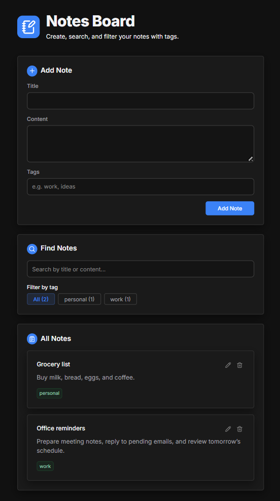

# Notes Board

A CRUD notes app built with React.

Create, edit, delete, search, filter, and manage tagged notes with local persistence and tested user flows.

Live demo: https://react-notes-board.vercel.app/

## Preview



## Features

- Add, edit and delete notes
- Add optional tags to notes
- Search notes by title or content
- Filter notes by tags
- Keep notes saved between sessions
- Show feedback while notes are saving or updating
- Cancel editing without changing the original note

## React Patterns Used

- Component-based UI structure
- Props for component communication
- Controlled form inputs
- State management with hooks
- Derived state for search and filters
- useEffect hook for localStorage persistence and debounced search
- useRef hook for scrolling to the edit form
- Conditional rendering for empty lists, search results, and save status messages

## Tech Stack

- React
- JavaScript
- HTML
- CSS
- Vite
- Vitest
- React Testing Library
- jest-dom
- user-event
- lucide-react

## Getting Started

```bash
npm install
npm run dev
```

Run tests:

```bash
npm test
```

Create a production build:

```bash
npm run build
```

## Project Status

The current version includes the main CRUD notes workflow, local persistence, search, tag filtering, async save/update handling, validation, and test coverage for key user behaviours.

Planned improvements include async data fetching, request cancellation, race-condition handling, optimistic updates, and responsive refinements.
